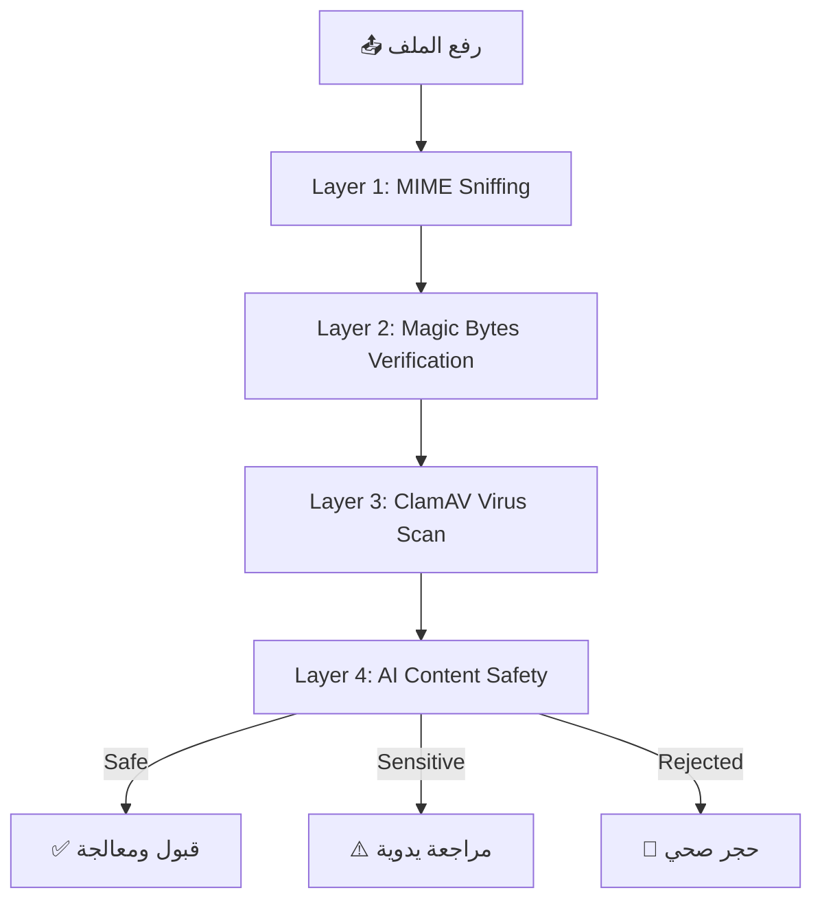

<p align="center">
  
  
  
  
  
</p>

<h1 align="center">🛡️ OpticVault — Secure Cloud Photography Platform</h1>

<p align="center">
  <b>منصة تصوير سحابية احترافية مبنية على معمارية حديثة مع ذكاء اصطناعي متكامل للإشراف والتصنيف التلقائي.</b>
</p>

---

## 📌 نظرة عامة (Overview)

**OpticVault** هو نظام باك إند متكامل لمنصة تصوير احترافية يقدم:

- 📷 **إدارة الصور والألبومات** مع دعم كامل للخصوصية (عام / خاص / مخفي)
- 🤖 **ذكاء اصطناعي** للإشراف على المحتوى والتصنيف التلقائي (Auto-Tagging & Safety)
- 🔒 **حماية متقدمة** بالعلامات المائية (Glassmorphic + Neon Gradient Watermarks)
- 🌐 **CDN مُحسّن** عبر ImageKit + S3 Origin Proxy لتسليم أصول فائقة السرعة
- 💬 **نظام محادثات** فوري مع إشعارات وبث مباشر (Real-time Broadcasting)
- 📊 **محرك توصيات** ذكي بتوزيع (50/20/30) للتغذية الشخصية

---

## 🏗️ الهيكلية المعمارية (Architecture)

```
OpticVault/
├── app/
│   ├── Http/
│   │   ├── Controllers/
│   │   │   ├── Api/V1/          # RESTful API Controllers (13 controllers)
│   │   │   ├── Api/             # Legacy & Admin Controllers
│   │   │   └── Web/             # Web Admin Panel Controllers
│   │   ├── Middleware/          # Security, Auth, Ban, CORS Middleware
│   │   └── Requests/           # Form Request Validation
│   ├── Models/                  # Eloquent Models with UUID support
│   │   └── Scopes/             # Global Scopes (ShadowPrivacy, Visibility)
│   ├── Services/
│   │   ├── AI/                  # AI Engines (Safety, Intelligence, Recommendation)
│   │   │   ├── Drivers/        # Sightengine, Cloudinary, ImageKit, Google Vision
│   │   │   ├── DTOs/           # Data Transfer Objects
│   │   │   └── Contracts/      # Interfaces & Abstractions
│   │   ├── Core/               # ImageService, AssetDelivery, ImageKit
│   │   └── Security/           # SecureShield, SharedLinks, SecurityService
│   ├── Jobs/                    # Background Processing (Image, Labels, Enhance)
│   ├── Observers/              # Event-driven logic (Image, Moderation)
│   ├── Policies/               # Authorization Policies (Image, Album)
│   └── Notifications/         # Email, Push & In-App Notifications
├── config/                      # App, CORS, Services, Filesystems configs
├── database/
│   └── migrations/             # Database schema with UUID support
├── routes/
│   └── api.php                 # Versioned API routes (V1)
└── docker-compose.prod.yml     # Production Docker orchestration
```

---

## ⚡ المميزات الرئيسية (Key Features)

### 🔐 الأمان والحماية
| الميزة | الوصف |
|--------|-------|
| **Multi-Layer File Validation** | MIME Sniffing → Magic Bytes → ClamAV Virus Scan |
| **SecureShield Watermarks** | علامات مائية بتقنية Glassmorphic + Neon Gradient |
| **Shadow Privacy System** | حجب خفي للمحتوى المخالف دون إبلاغ المستخدم |
| **Shared Links** | روابط مشفرة بكلمات مرور + TTL عبر Redis + Token Rotation |
| **Security Headers** | CSP, X-Frame-Options, HSTS لمنع الهجمات الشائعة |

### 🤖 الذكاء الاصطناعي
| الميزة | الوصف |
|--------|-------|
| **Content Safety** | فحص تلقائي متعدد المحركات (Sightengine → Cloudinary Failover) |
| **Auto-Tagging** | تصنيف هرمي تلقائي للصور (Google Vision → Cloudinary → ImageKit) |
| **AI Descriptions** | توليد وصف تلقائي للصور باستخدام الذكاء الاصطناعي |
| **Quality Grading** | تقييم جودة الصورة تلقائياً وتحسينها عند الحاجة |
| **Recommendation Engine** | محرك توصيات بتوزيع 50% مباشر / 20% اكتشاف / 30% ترندينج |

### 🚀 الأداء
| الميزة | الوصف |
|--------|-------|
| **CDN Delivery** | ImageKit Origin Proxy + S3 لتسليم صور بزمن تحميل < 100ms |
| **Redis Caching** | تخزين مؤقت ذكي للتغذية والتوصيات والإحصائيات |
| **Background Processing** | معالجة الصور والتحليل عبر Queue Workers |
| **Anti-Clustering** | خوارزمية فريدة لتوزيع المحتوى في الفيد دون تكرار |

---

## 🛠️ التقنيات المستخدمة (Tech Stack)

| التقنية | الإصدار | الاستخدام |
|---------|---------|-----------|
| **Laravel** | 11.x | إطار العمل الأساسي |
| **PHP** | 8.3 | لغة البرمجة |
| **Redis** | 7.x | التخزين المؤقت والـ Real-time |
| **SQLite/MySQL** | - | قاعدة البيانات |
| **Laravel Sanctum** | 4.x | مصادقة API (Token-based) |
| **Spatie Permission** | 6.x | إدارة الأدوار والصلاحيات |
| **Spatie MediaLibrary** | 11.x | إدارة الوسائط |
| **Spatie Tags** | 4.x | نظام التوسيم |
| **Intervention Image** | 3.x | معالجة الصور (GD/Imagick) |
| **Sightengine API** | - | فحص سلامة المحتوى |
| **ImageKit** | - | CDN وتحويل الصور |
| **AWS S3** | - | التخزين السحابي |
| **Docker** | - | الحاويات والنشر |
| **Laravel Reverb** | - | WebSocket Broadcasting |

---

## 🚀 التشغيل (Getting Started)

### المتطلبات الأساسية
```bash
PHP >= 8.3
Composer >= 2.x
Redis Server
Node.js >= 18 (للـ Broadcasting)
```

### التثبيت المحلي
```bash
# 1. استنساخ المشروع
git clone <repository-url>
cd OpticVault

# 2. تثبيت الحزم
composer install

# 3. إعداد البيئة
cp .env.example .env
php artisan key:generate

# 4. تشغيل المهاجرات
php artisan migrate --seed

# 5. ربط التخزين
php artisan storage:link

# 6. تشغيل الخادم
php artisan serve
```

### النشر بـ Docker
```bash
# بيئة الإنتاج
docker-compose -f docker-compose.prod.yml up -d --build

# تشغيل Queue Workers
docker exec opticvault-app php artisan queue:work --tries=3 --timeout=300
```

---

## 🔑 متغيرات البيئة (Environment Variables)

| المتغير | الوصف |
|---------|-------|
| `APP_KEY` | مفتاح التشفير الأساسي |
| `SIGHTENGINE_API_USER` | حساب Sightengine للـ AI Safety |
| `SIGHTENGINE_API_SECRET` | مفتاح Sightengine |
| `AWS_ACCESS_KEY_ID` | مفتاح AWS S3 |
| `AWS_SECRET_ACCESS_KEY` | سر AWS S3 |
| `AWS_DEFAULT_REGION` | منطقة S3 |
| `AWS_BUCKET` | اسم حاوية S3 |
| `IMAGEKIT_PUBLIC_KEY` | مفتاح ImageKit العام |
| `IMAGEKIT_PRIVATE_KEY` | مفتاح ImageKit الخاص |
| `IMAGEKIT_URL_ENDPOINT` | نقطة وصول ImageKit |
| `REDIS_HOST` | خادم Redis |
| `CORS_ALLOWED_ORIGINS` | النطاقات المسموح بها (مفصولة بفاصلة) |

---

## 📡 نقاط الـ API (API Endpoints)

### المصادقة (Authentication)
```
POST   /api/v1/auth/register          # تسجيل حساب جديد
POST   /api/v1/auth/login             # تسجيل الدخول
POST   /api/v1/auth/verify            # التحقق من البريد الإلكتروني
POST   /api/v1/auth/forgot-password   # استعادة كلمة المرور
POST   /api/v1/auth/logout            # تسجيل الخروج
```

### الصور والألبومات
```
GET    /api/v1/gallery                # المعرض العام
POST   /api/v1/albums                 # إنشاء ألبوم
POST   /api/v1/albums/{id}/upload     # رفع صور للألبوم
GET    /api/v1/feed                   # التغذية الشخصية
POST   /api/v1/feed/{id}/like         # إعجاب
POST   /api/v1/feed/{id}/bookmark     # حفظ
```

### الملفات الشخصية والإعدادات
```
GET    /api/v1/me                     # ملف تعريف المستخدم
PUT    /api/v1/me/update              # تحديث الملف الشخصي
PUT    /api/v1/me/security            # إعدادات الأمان
GET    /api/v1/me/storage-stats       # إحصائيات التخزين
```

### المشاركة والتواصل
```
POST   /api/v1/share/image/{id}       # مشاركة صورة
POST   /api/v1/share/album/{id}       # مشاركة ألبوم
GET    /api/v1/chat/conversations     # المحادثات
POST   /api/v1/chat/{id}/send         # إرسال رسالة
```

---

## 🔒 طبقات الأمان (Security Layers)



---

## 📊 نتائج مراجعة الكود (Code Review Summary)

### ✅ نقاط القوة
- ✅ هيكلية نظيفة ومنظمة (Service Layer Pattern)
- ✅ نظام UUID شامل لجميع النماذج
- ✅ نظام Failover للذكاء الاصطناعي (Fail-Closed Policy)
- ✅ فصل كامل بين واجهات API و الـ Business Logic
- ✅ طبقات أمان متعددة (MIME + Magic Bytes + ClamAV + AI)
- ✅ نظام العلامات المائية (SecureShield v3.0)
- ✅ محرك التوصيات بخوارزمية Anti-Clustering
- ✅ إدارة الأدوار والصلاحيات عبر Spatie Permission
- ✅ نظام Rate Limiting متعدد المستويات

### ⚠️ ملاحظات للصيانة
- ⚠️ التأكد من تثبيت الخطوط (Fonts) على خادم الإنتاج (Docker)
- ⚠️ تفعيل Redis AOF Persistence لحماية الروابط المؤقتة
- ⚠️ مراقبة أداء الـ Feed API تحت الحمل العالي
- ⚠️ توثيق جميع متغيرات `.env` في `.env.example`

---

## 📄 الرخصة (License)

هذا المشروع مرخص تحت رخصة **MIT**. للمزيد من التفاصيل، انظر ملف [LICENSE](LICENSE).

---

<p align="center">
  <b>صُنع بـ ❤️ بواسطة فريق OpticVault</b><br>
  <sub>مشروع تخرج — 2026</sub>
</p>
