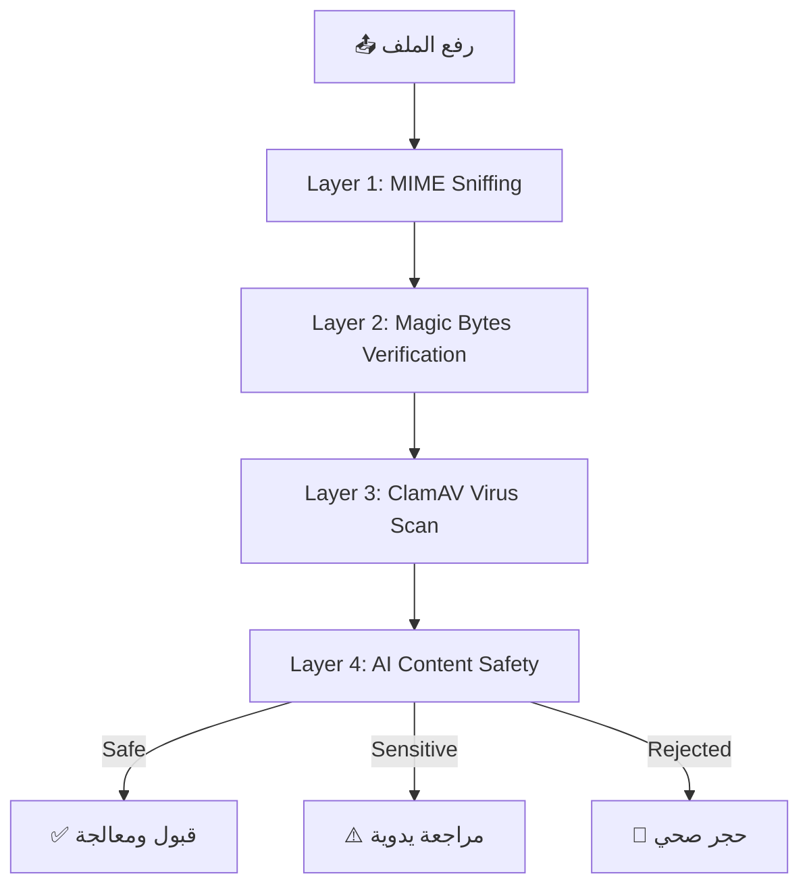

<p align="center">
  
  
  
  
  
</p>

<h1 align="center">🛡️ OpticVault — Secure Cloud Photography Platform</h1>

<p align="center">
  <b>منصة تصوير سحابية احترافية مبنية على معمارية حديثة مع ذكاء اصطناعي متكامل، نظام محادثات NoSQL، ورصد أداء فائق.</b>
</p>

---

## 📌 نظرة عامة (Overview)

**OpticVault** هو نظام باك إند متكامل لمنصة تصوير احترافية يقدم:

- 📷 **إدارة الصور والألبومات** مع دعم كامل للخصوصية (عام / خاص / مخفي) ونظام تعاون (Collaborators).
- 🤖 **ذكاء اصطناعي** متطور للإشراف، التصنيف التلقائي، ومحرك توصيات (Anti-Clustering & Diversity).
- 🔒 **حماية SecureShield** بالعلامات المائية (Glassmorphic + Neon Gradient) وتشفير الروابط.
- 🌐 **CDN هجين** عبر ImageKit + DigitalOcean Spaces لتسليم أصول فائقة السرعة.
- 💬 **نظام محادثات NoSQL** فوري (فردي وجماعي) مبني على MongoDB للتوسعية العالية.
- 📈 **رصد شامل (Observability)** عبر New Relic لتتبع الأداء (APM) والسجلات (Logging).

---

## 🏗️ الهيكلية المعمارية (Architecture)

```
OpticVault/
├── app/
│   ├── Http/
│   │   ├── Controllers/
│   │   │   ├── Api/V1/          # RESTful API Controllers (Auth, Profile, Chat, Feed, etc.)
│   │   │   └── Api/             # Admin & Legacy Controllers
│   ├── Services/
│   │   ├── AI/                  # AI Engines (Safety, Recommendation, Multi-Driver Support)
│   │   ├── Core/               # ImageService, AssetDelivery (ImageKit + DO Spaces)
│   │   └── Security/           # SecureShield, SharedLinks, OAuth Profile Sync
│   ├── Models/                  # SQL (MySQL) & NoSQL (MongoDB for Chats)
│   ├── Jobs/                    # Background Processing (AI Scanning, Notifications)
│   └── Notifications/         # Multi-channel (Email, Database, Push)
├── docker/                      # Production Configuration (PHP-FPM, Nginx, New Relic)
├── routes/
│   └── api.php                 # Full Versioned API routes (V1)
└── api_documentation.md        # 📖 Detailed API Guide
```

---

## ⚡ المميزات الرئيسية (Key Features)

### 🔐 الأمان والحماية المتقدمة
| الميزة | الوصف |
|--------|-------|
| **SecureShield v3.0** | حماية الصور بعلامات مائية ديناميكية تمنع السرقة مع الحفاظ على الجمالية. |
| **OAuth 2.0 Integration** | تسجيل دخول موحد عبر Google, Instagram, Facebook, و Adobe مع مزامنة البروفايل. |
| **Shadow Privacy** | نظام حظر "خفي" للمحتوى المشبوه لحماية المجتمع دون تنبيه المخالفين. |
| **SSL/TLS Hardening** | تشفير كامل للبيانات مع إخفاء هوية السيرفر (Signature Obfuscation). |

### 🤖 الذكاء الاصطناعي والتوصيات
| الميزة | الوصف |
|--------|-------|
| **Hybrid Recommendation** | محرك ذكي يجمع بين (Trending, Discovery, Personal) مع منع التكرار (Seen-Images Exclusion). |
| **Diversity Algorithm** | خوارزمية تمنع تكتل صور مصور واحد في الفيد لضمان التنوع البصري. |
| **Fail-Safe Moderation** | فحص تلقائي مزدوج (AI Scanning) مع سياسة الحجر الصحي التلقائي. |

### 🚀 الأداء والرصد (Observability)
| الميزة | الوصف |
|--------|-------|
| **New Relic Full-Stack** | رصد لحظي للأداء (APM)، تتبع الأخطاء، وربط السجلات (Logs-in-Context). |
| **NoSQL Chat Architecture** | استخدام MongoDB للمحادثات لضمان سرعة فائقة في معالجة ملايين الرسائل. |
| **Distributed Storage** | تكامل DO Spaces مع ImageKit لتقليل زمن الاستجابة (Latency) عالمياً. |

---

## 🛠️ التقنيات المستخدمة (Tech Stack)

| التقنية | الدور |
|---------|-----------|
| **Laravel 11 & PHP 8.3** | Core Framework (Modern, Type-safe) |
| **MySQL & MongoDB** | Dual-Database Strategy (Relational + NoSQL) |
| **Redis** | High-speed Caching & Feed Storage |
| **New Relic** | Production Monitoring & Observability |
| **ImageKit & DO Spaces** | Edge Delivery & Cloud Origin Storage |
| **Sanctum & OAuth** | Unified Authentication System |
| **Laravel Reverb** | Real-time WebSocket Broadcasting |

---

## 📡 نقاط الـ API (API Endpoints) - V1

> [!IMPORTANT]
> للحصول على توثيق كامل وشامل لجميع الـ Endpoints، يرجى مراجعة ملف [**API Documentation**](./api_documentation.md).

### مقتطف من المسارات الأساسية:
- `POST /api/v1/auth/login` - الدخول الموحد.
- `GET  /api/v1/feed/home` - التغذية الذكية (AI Powered).
- `GET  /api/v1/chat/conversations` - المحادثات (MongoDB).
- `POST /api/v1/images/{id}/protect` - تفعيل حماية SecureShield.
- `POST /api/v1/upload/batch` - الرفع الجماعي (Bulk Upload).

---

## 🚀 التشغيل والنشر (Deployment)

### النشر باستخدام Docker (الإنتاج)
تم إعداد المشروع ليعمل بشكل مثالي في بيئة معزولة مع تفعيل New Relic تلقائياً:
```bash
# بناء التشغيل للإنتاج
docker-compose -f docker-compose.prod.yml up -d --build

# تفعيل التحسينات
docker exec opticvault-app php artisan optimize
```

---

<p align="center">
  <b>صُنع بـ ❤️ بواسطة فريق opalshot</b><br>
  <sub>مشروع تخرج — 2026</sub>
</p>
            # إعدادات الأمان
GET    /api/v1/me/storage-stats       # إحصائيات التخزين
```

### المشاركة والتواصل
```
POST   /api/v1/share/image/{id}       # مشاركة صورة
POST   /api/v1/share/album/{id}       # مشاركة ألبوم
GET    /api/v1/chat/conversations     # المحادثات
POST   /api/v1/chat/{id}/send         # إرسال رسالة
```

### أدوات المساعدين (Utility Helpers)
```
GET    /api/v1/utils/format-bytes     # تنسيق أحجام الملفات
GET    /api/v1/utils/format-number    # تنسيق الأرقام الكبيرة (K/M)
GET    /api/v1/utils/mask-email       # تشفير الإيميلات للخصوصية
GET    /api/v1/utils/image-orientation # حساب أبعاد الصورة
```

---

## 🔒 طبقات الأمان (Security Layers)



---

## 📊 نتائج مراجعة الكود (Code Review Summary)

### ✅ نقاط القوة
- ✅ هيكلية نظيفة ومنظمة (Service Layer Pattern)
- ✅ نظام UUID شامل لجميع النماذج
- ✅ نظام Failover للذكاء الاصطناعي (Fail-Closed Policy)
- ✅ فصل كامل بين واجهات API و الـ Business Logic
- ✅ طبقات أمان متعددة (MIME + Magic Bytes + ClamAV + AI)
- ✅ نظام العلامات المائية (SecureShield v3.0)
- ✅ محرك التوصيات بخوارزمية Anti-Clustering
- ✅ إدارة الأدوار والصلاحيات عبر Spatie Permission
- ✅ نظام Rate Limiting متعدد المستويات

### ⚠️ ملاحظات للصيانة
- ⚠️ التأكد من تثبيت الخطوط (Fonts) على خادم الإنتاج (Docker)
- ⚠️ تفعيل Redis AOF Persistence لحماية الروابط المؤقتة
- ⚠️ مراقبة أداء الـ Feed API تحت الحمل العالي
- ⚠️ توثيق جميع متغيرات `.env` في `.env.example`

---

## 📄 الرخصة (License)

هذا المشروع مرخص تحت رخصة **MIT**. للمزيد من التفاصيل، انظر ملف [LICENSE](LICENSE).

---

<p align="center">
  <b>صُنع بـ ❤️ بواسطة فريق opalshot</b><br>
  <sub>مشروع تخرج — 2026</sub>
</p>
