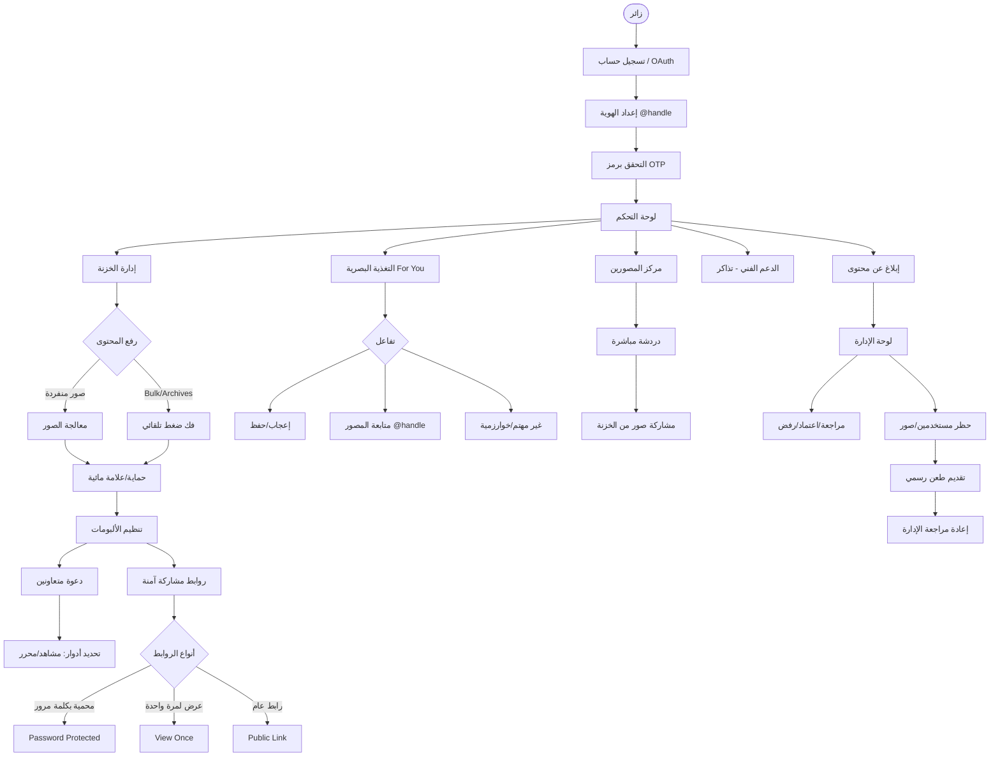

# 🚀 مخطط تدفق المستخدم - opalshot (User Flow)

هذا المستند يوضح الرحلات المختلفة التي يخوضها المستخدم داخل منصة **opalshot**، من لحظة الانضمام وحتى التحكم المتقدم في المحتوى والتفاعل الاجتماعي.

---

## 📽️ المخطط العام (Mermaid Diagram)

---

## 🔍 شرح التدفقات بالتفصيل

### 1️⃣ رحلة الانضمام والهوية (Onboarding & Identity)
تبدأ رحلة المستخدم بالتسجيل المرن (بريد إلكتروني أو حسابات التواصل). نركز هنا على **الهوية الفريدة** حيث يختار المستخدم `@handle` خاص به، مع نظام **التحقق الثنائي (OTP)** لضمان أن كل مستخدم حقيقي ومحمي.

### 2️⃣ إدارة المحتوى والخزنة (Vault & Media Management)
الخزنة هي قلب المنصة. يمكن للمصورين رفع ألبومات كاملة (Zip) حيث يقوم النظام **بفك الضغط في الخلفية**. يتميز النظام بـ **الرفع الذكي** وإمكانية تطبيق **حماية فورية** (علامات مائية أو روابط مؤقتة) قبل تنظيم الصور في ألبومات احترافية.

### 3️⃣ الاكتشاف والتفاعل الاجتماعي (Discovery & Engagement)
عبر صفحة **"For You"**، يتفاعل المستخدم مع خوارزمية ذكية تقيس مدى اهتمامه بناءً على **مدة البقاء (Dwell Time)** والتفاعل. يمكن بناء شبكة علاقات عبر متابعة المصورين المفضلين واستكشاف معارضهم العامة بالـ `@handle`.

### 4️⃣ التعاون والمشاركة (Collaboration & Sharing)
تتيح المنصة **التعاون الجماعي** في الألبومات مع تحديد صلاحيات دقيقة (من يشاهد ومن يحرر). أما في المشاركة الخارجيه، فيمكن توليد **روابط ذكية** (محمية بكلمات مرور أو تنتهي بعد أول مشاهدة) لضمان أقصى درجات الخصوصية.

### 5️⃣ مركز التواصل والدردشة (Photographers Hub & Chat)
ليس مجرد معرض صور، بل منصة تواصل. في **Hub**، يمكن للمصورين الدردشة مباشرة ومشاركة صورهم الخاصة من الخزنة داخل المحادثة لتسهيل أعمال التعاون والبيع. كما يتوفر نظام **دعم فني متكامل** لحل المشكلات التقنية.

### 6️⃣ الأمان، الرقابة، والطعون (Safety & Appeals)
للحفاظ على جودة المجتمع، تتوفر أدوات **إبلاغ متطورة**. في حال اتخاذ إجراء إداري، يُسمح للمستخدم بتقديم **طعن رسمي (Appeal)** تتم مراجعته من قبل المشرفين عبر **لوحة الإدارة الشاملة** لضمان العدالة والشفافية.

---
> [!TIP]
> جميع هذه التدفقات مصممة لتكون متكاملة؛ فمثلاً يمكن للمستخدم رفع صورة في الخزنة (2)، ثم مشاركتها في الدردشة (5)، وتلقي إعجابات عليها (3) في آن واحد.
